# FlixList

A Web application which implements CRUD operations and Production Engineering (PE) tools/infrastructure as part of the PE track from Major League Hacking (MLH), powered by Facebook.

## Demo video

https://youtu.be/MZpIWgZYw3A

## Installation

1. Install `pip` and `python3.8` or greater
2. Create virtual environment 
    ```bash
    $ python3 -m venv python3-virtualenv
    ```
3. Activate virtual environment
    ```bash
    $ source python3-virtualenv/bin/activate
    ```
        or (for Windows)
    ```
        $ python3-virtualenv/scripts/activate     
    ```
4. Install dependencies
    ```bash
    $ pip3 install -r requirements.txt
    ```

## Usage

Below are instructions to run the application, and obtaining the database schema locally:

1. Running a Flask development server
    ```bash
    $ FLASK_DEBUG=1 python wsgi.py run --host=0.0.0.0
    ```

2. Running docker-compose
    ```bash
    $ docker-compose up --build -d
    ```

3. Obtain and inspect database:
    ```bash 
    $ docker-compose exec web python wsgi.py create_db
    $ docker-compose exec db psql --username=admin --dbname=flixlist
    ```
    ```postgres
    flixlist=# \dt
    ```

## What is it? What does it do?

FlixList is a web application (app) where users can keep a record of their Flix. We define "Flix" as either movies or tv shows for now.  Users must first login or register to gain access to the site's services.

### Landing page

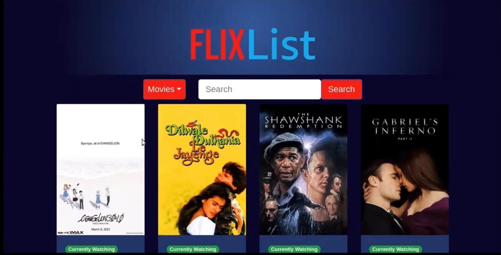 

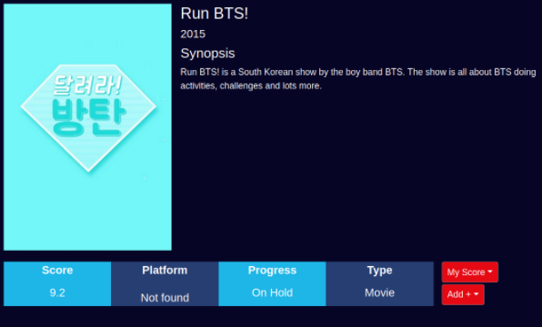

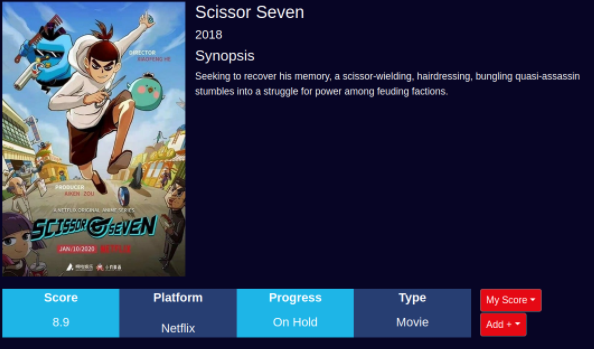

### Login/Register pages

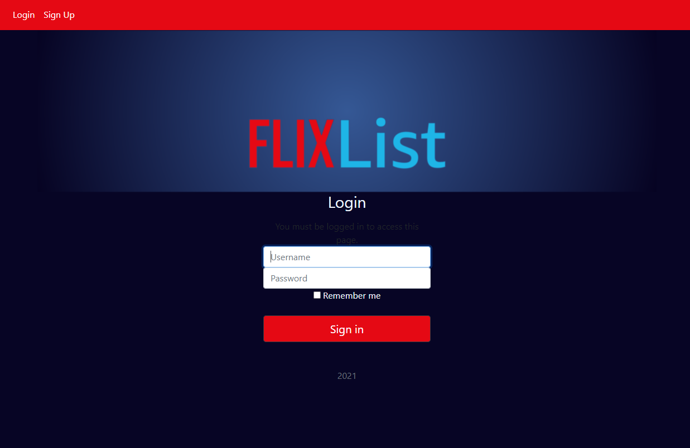

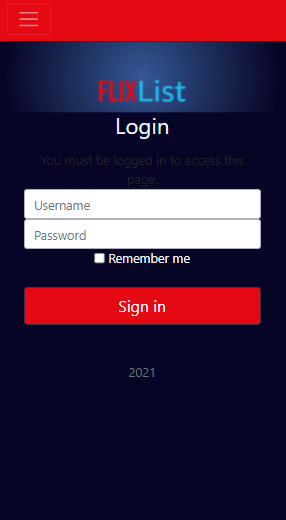

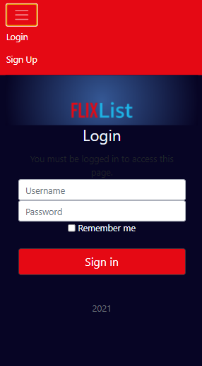 

### Show Details

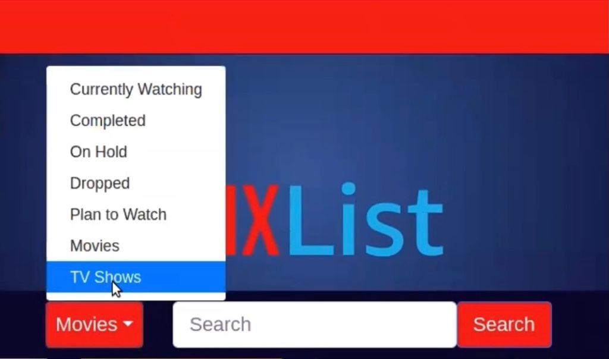

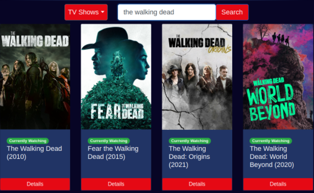 

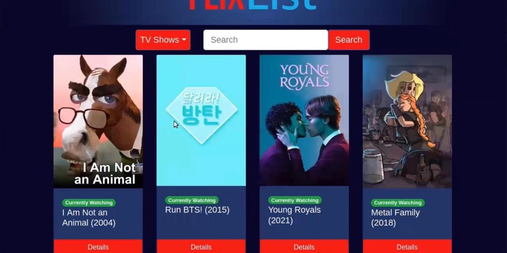

## Sample pages

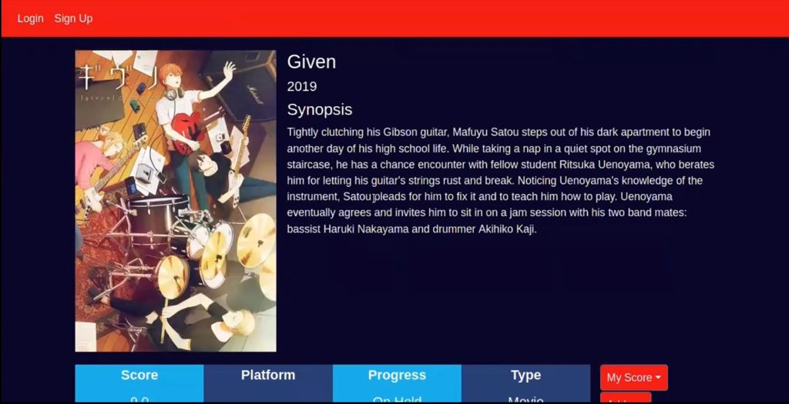

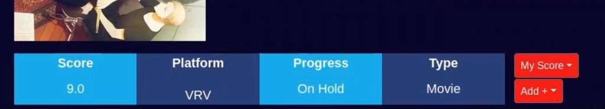

## Recommendations

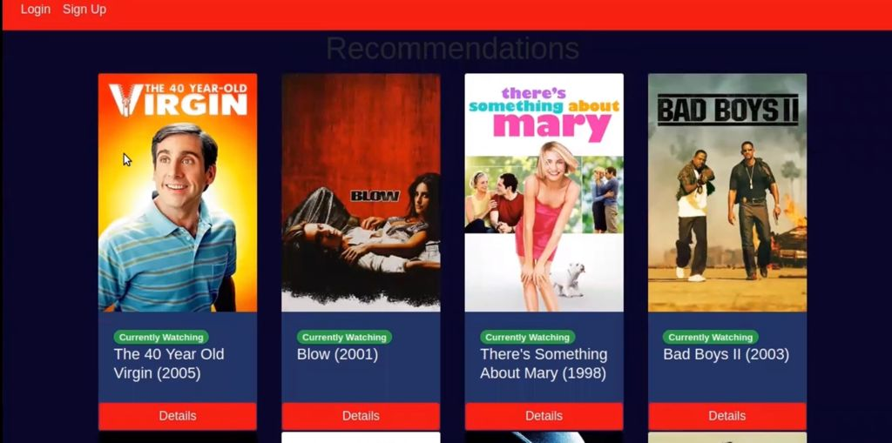 

## Search

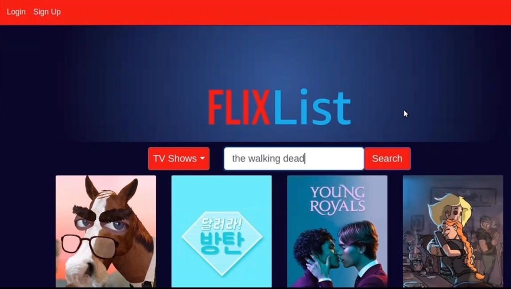 

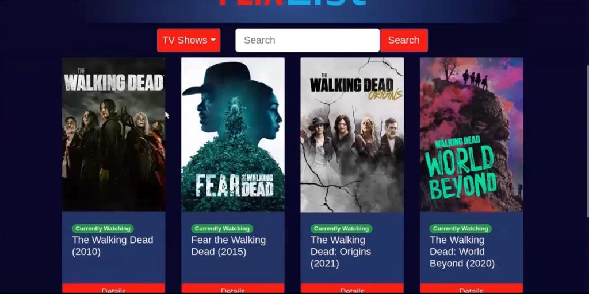 

## Inspiration

We initially started by brainstorming different ideas that suited our interests. At first, we each had about 1-2 ideas but, we weren't really attracted to them. We had a blocker during our creative process when we thought brainstormed individually. We took a different approach and met to discuss our ideas in depth and expand the creative thought process by partaking in an activity. The activity started off with going through the letters of the alphabet and thinking of a subject/topic/title that matched with the index and give a brief description of what it would entail. We did this for a few rounds until we shared our thoughts and collectively chose an idea. And thus -- we have FlixList.

We liked the idea as it stood out to us as a practical solution to keeping a record of the great variety of media that we consume as a society. Watching Flix -- whether it's trendy or not -- is what keeps many of us close to our friends, family, and the world. Start using FlixList today at flixlist.tech and let us know what you like about it and how we can further improve it! (:

## About the team

| Rodrigo Luna | Linh Truong | Ayana Nithey |  
| :-: | :-: | :-: |  
| Rodrigo is a Mechatronics student. He loves embedded systems. | Linh is in her last semester as a Computer Systems Technology student. She has experience in Agile, monitoring Jenkins CI/CD builds and OOP within a large code-base. | Ayana is a CS & Math graduate. She has experience supporting web and mobile applications. |  

## Tech stack used

### Overview

Languages, frameworks, platforms, cloud services, databases, APIs, or other technologies include Python, Flask, HTML, CSS, VPS, CentOS distribution on AWS, duckdns, NGINX, SSL, The Movie Database, Gunicorn, Postgres, Postman API, cURL, Docker, GitHub Actions, Prometheus, and Grafana.

### Spike 1

> Started with the frontend code of the website in Python, HTML and CSS in addition to the web app framework Flask. Flask allowed us to get started quick and easy as it is know to have the ability to scale up to a complex app.

> Next, we set up a VPS to mimic the server environment within a shared server. We chose this option as it is cost efficient and known to provide security, reliability and better performance. 

> Then, we spin up an EC2 CentOS instance on AWS and tested endpoints. We did this to be informed on metrics and health of the service for monitoring and logging purposes.

> At the end of the week, we came up with a minimum viable product (MVP) to get feedback from our Pod leader and Podmates.

### Spike 2

> We listened to their feedback and implemented changes as we continued to set up duckdns to host our application, accessible at domain flixlist.tech. To do this, we set up a reverse proxy using NGINX and SSL certificates to secure our app.

> Then we set up SSH on our machines to connect to the centOS virtual machine to enhance the workflow. Once completed, we set up the site as a service using Gunicorn and creating a WSGI entry point to interact with the app.

> An important feature we implemented was the addition of the Database functionality which entails technologies such as Postgres and the TMDB API. Likewise, we performed integration testing using Postman API and cURL to test the API.

> In addition, we added the database caching and configured the app. Finally, we set up the environment for docker and continue to containerise Flask, the database, and NGINX.

### Spike 3

> In the next phase, we built tests that run linter checks over the code to ensure the project is robust. We paired this with polishing up the code and testing it.

> We then automated a CI/CD pipeline using GitHub Actions to deploy the website to monitor the apps response times, memory, and latency. This consisted of defining the deployment workflow by preparing secrets, connecting to SSH through GitHub Actions, and set up the deployment step.

> At this point, the site is automatically deployed to AWS on docker containers, using nginx as our web-server to reverse proxy to direct users to the appropriate requests. 

> Next, we began to monitor containers using cAdvisor to develop our understanding of resource usage and perfomance characteristics of the running containers.

> Finally, we set up Prometheus by injecting the same metrics from cAdvisor to better analyze the metrics. Then added a Grafana service and further configure to access the dashboard.

## Challenges we ran into

It was a challenging process to work with time management and working with new technologies such as Prometheus 
and Grafana.

## Accomplishments we are proud of

We are proud to come up with an idea that involved everyones contribution. We are proud to expand our knowledge by putting them into use with this project. 

## What's next

We would like to reflect upon the tech stack and present a clear understanding of the architecture by using a UML diagram. Additionally, we would like to improve on accessibility by following WCAG in more detail. We would also like to improve on the functionality and get the site to run in a stable way and perhaps set up a firewall, implement the recommendations page, and the friend list.